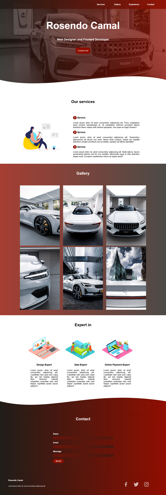

# Primera práctica de desarrollo web - Práctica de portafolio

Este proyecto es una página web personal como un diseñador web y desarrollador frontend. La página incluye secciones para mostrar servicios, galería de trabajos, experiencia y un formulario de contacto.

## Características

- **Navegación sencilla**: Menú de navegación claro y fácil de usar para acceder a todas las secciones.
- **Galería de trabajos**: Una sección dedicada a mostrar el portafolio visual.
- **Formulario de contacto**: Permite a los visitantes ponerse en contacto con Rosendo.
- **Redes sociales**: Enlaces a perfiles de redes sociales (Facebook, Twitter, Instagram).

## Tecnologías Utilizadas
- **HTML5**: Para la estructura de la página web.
- **CSS3**: Para el diseño y los estilos visuales.
- **Boxicons**: Para los iconos sociales (Facebook, Twitter, Instagram).
- **SVG**: Para los elementos gráficos como las transiciones onduladas entre las secciones.

## Ver Proyecto

Puedes ver el proyecto desplegado en [**GitHub Pages**](https://rosendocamal.github.io/practice-portfolio).

## Licencia

Este proyecto está licenciado bajo la Licencia Pública General de GNU v3.0. Para más detalles, consulta el archivo [LICENSE](LICENSE).

Créditos

- Illustrations: Las ilustraciones utilizadas en este sitio provienen de [Manipixels](https://www.manypixels.co/gallery).
- Fotos: Algunas fotos en la galería fueron tomadas por [redcharlie](https://unsplash.com/@redcharlie) en [Unsplash](https://unsplash.com/).
- SVG: Las secciones con SVG provienen de [Smoothie](https://smooth.ie/blogs/news/svg-wavey-transitions-between-sections)
- Íconos: Gracias a [Boxicons](https://boxicons.com/ )

